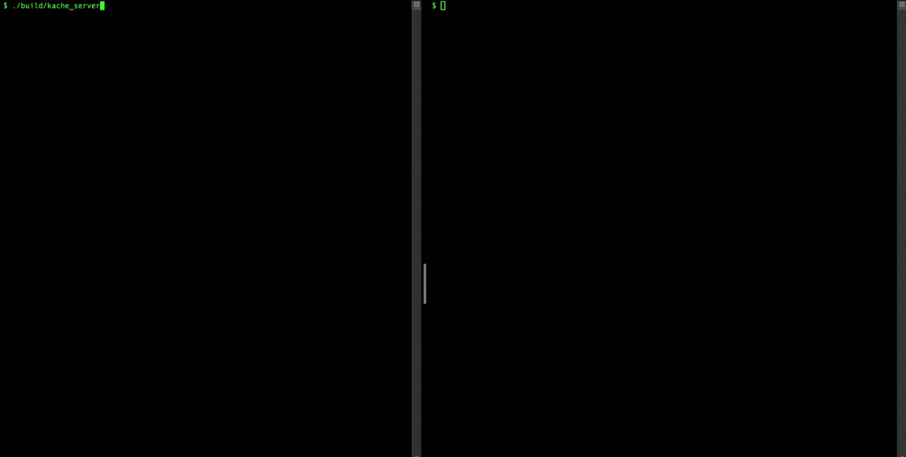

# Kache: A High-Performance Concurrent Key-Value Store

<p align="center">
  
  
  
</p>

Kache is a high-performance, multithreaded, in-memory key-value store built from scratch in modern C++. It is designed to handle multiple concurrent clients efficiently and speaks the Redis Serialization Protocol (RESP) for communication.

<p align="center">
   
</p>

## Key Features

* **🚀 High-Performance Concurrency:** Utilizes a fixed-size thread pool to manage client connections, avoiding the overhead of thread creation per request and enabling stable, high-throughput I/O.
* ** RESP-Compliant Protocol:** Communicates using the Redis Serialization Protocol (RESP), allowing it to be understood by various Redis tools and clients.
* **🔩 Built from Scratch:** Implemented entirely in C++ using low-level TCP socket APIs for networking, with no external libraries for the core server logic.
* **🧵 Thread-Safe Data Store:** The core key-value map is protected by `std::mutex` to ensure safe, serialized access and prevent data corruption during simultaneous read/write operations.
* **💻 Interactive CLI:** Includes a simple command-line interface (`kache-cli`) for easy, interactive use and testing.
* **🛠️ Modern C++:** Leverages C++17 features like `std::optional`, `std::mutex`, and `std::condition_variable` for robust and clean code.

## Architecture Overview

Kache operates on a classic thread pool server model designed for high concurrency:

1.  **Main Thread:** The primary server thread is responsible for setting up the TCP socket and entering an infinite loop to listen for and `accept()` new client connections.
2.  **Task Queue:** When a new client connects, the main thread does not handle it directly. Instead, it wraps the client-handling logic into a task and pushes it onto a thread-safe task queue.
3.  **Worker Threads:** A fixed number of worker threads are created when the server starts. These threads constantly monitor the task queue.
4.  **Task Execution:** When a worker thread finds a task (a new client), it dequeues it and takes ownership of that client's socket, handling all subsequent commands from that client until disconnection.

This architecture scales effectively by decoupling connection acceptance from client management, allowing the server to handle many concurrent clients with a limited number of threads.

## Getting Started

Follow these instructions to build and run Kache on your local machine.

### Prerequisites

* A C++17 compliant compiler (e.g., GCC, Clang)
* CMake (version 3.10 or higher)
* Git

### Build & Run

1.  **Clone the repository:**
    ```bash
    git clone [https://github.com/lewlinantony/Kache.git](https://github.com/lewlinantony/Kache.git)
    cd Kache
    ```

2.  **Configure and build the project with CMake:**
    ```bash
    cmake -B build
    cmake --build build
    ```

3.  **Run the Kache server:**
    Open a terminal window and start the server. It will listen on port 6379.
    ```bash
    ./build/kache_server
    ```

4.  **Connect with the Kache CLI:**
    Open a **second** terminal window and run the client.
    ```bash
    ./build/kache_cli
    ```

### Usage

Once connected to the server using the CLI, you can issue commands like:

```
$ SET name Kache
OK

$ GET name
Kache

$ EXISTS name
(integer) 1

$ DELETE name
(integer) 1

$ GET name
(nil)

$ exit
```

---

## 📝 License

This project is licensed under the MIT License.  
See the [LICENSE](./LICENSE) file for details.
